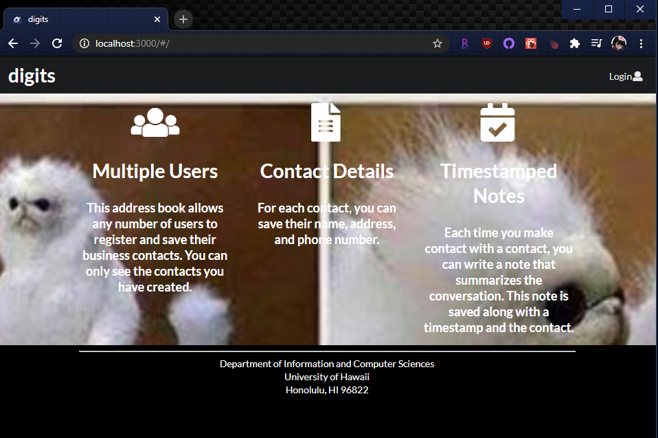
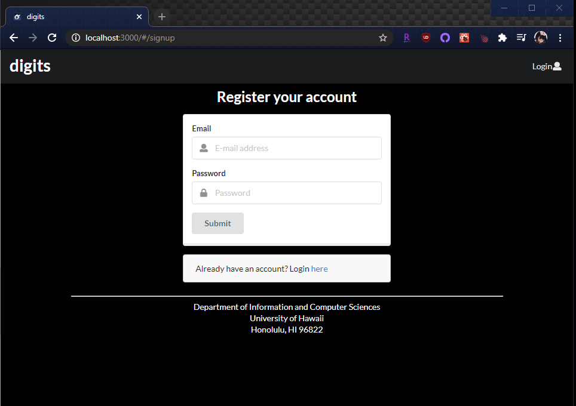
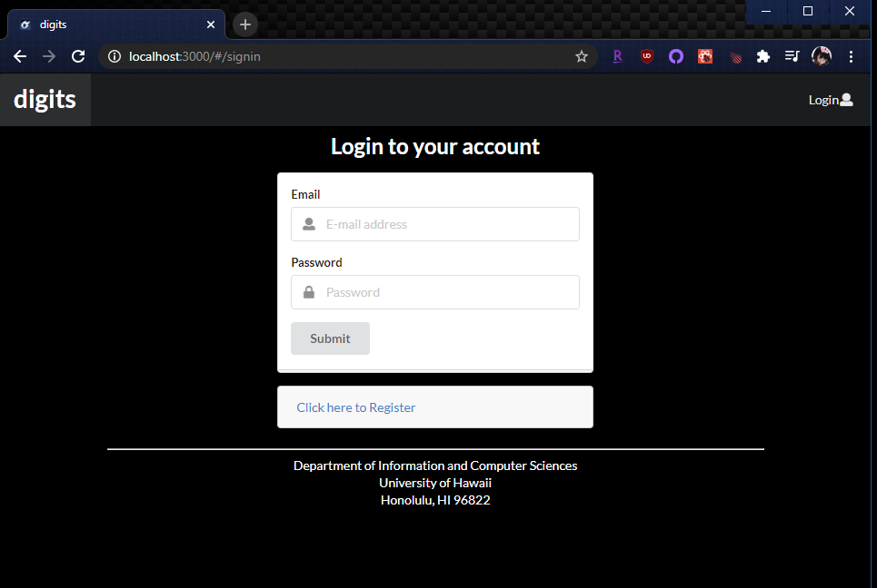
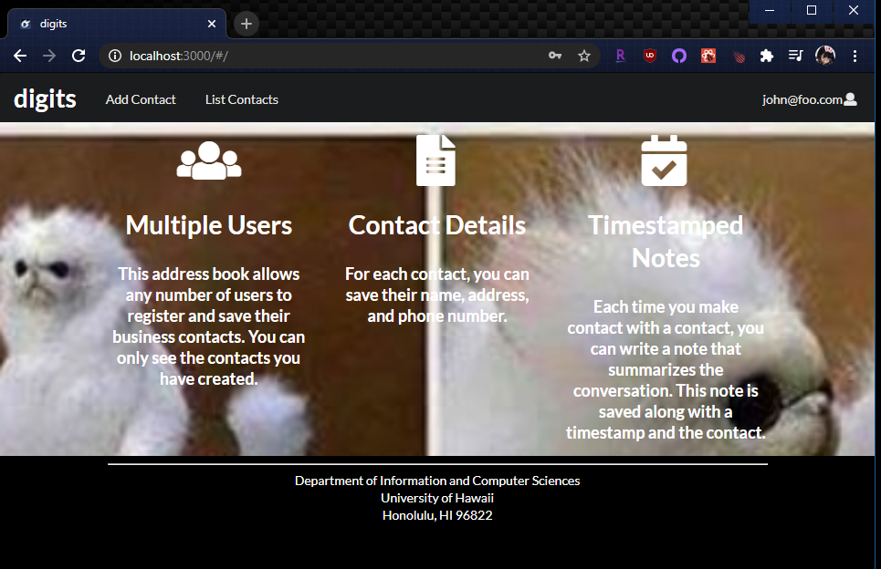
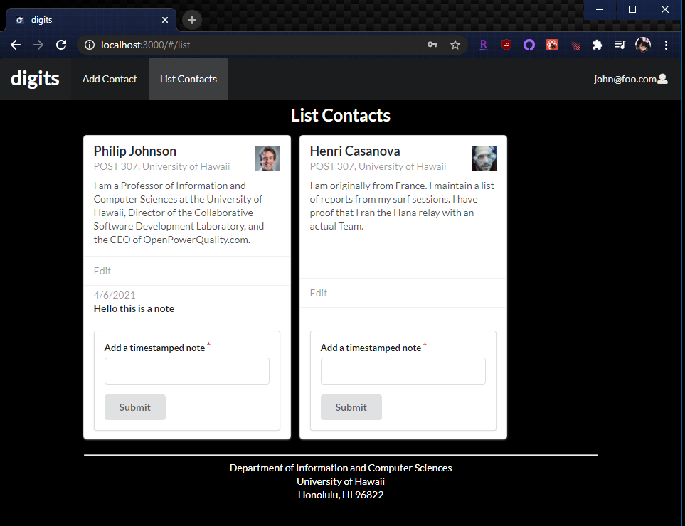
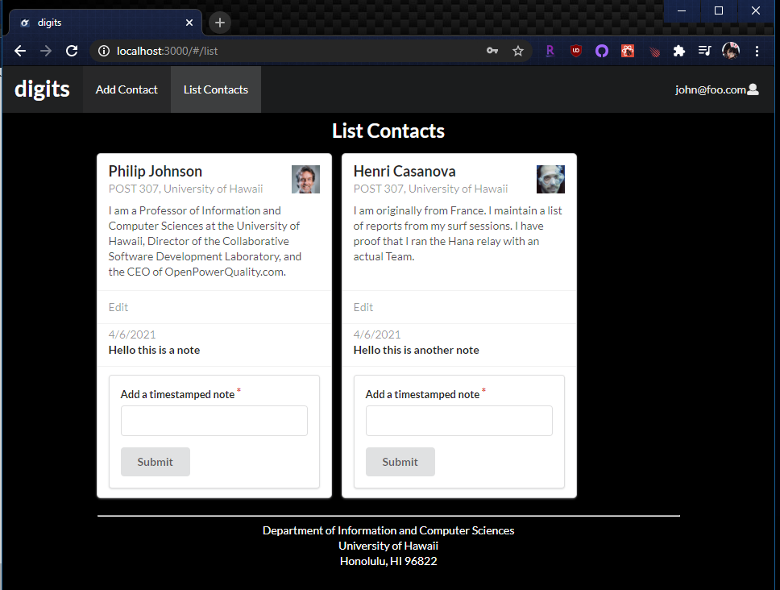
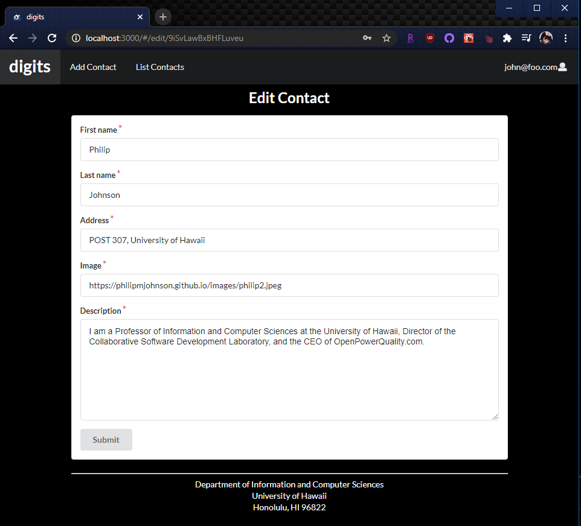
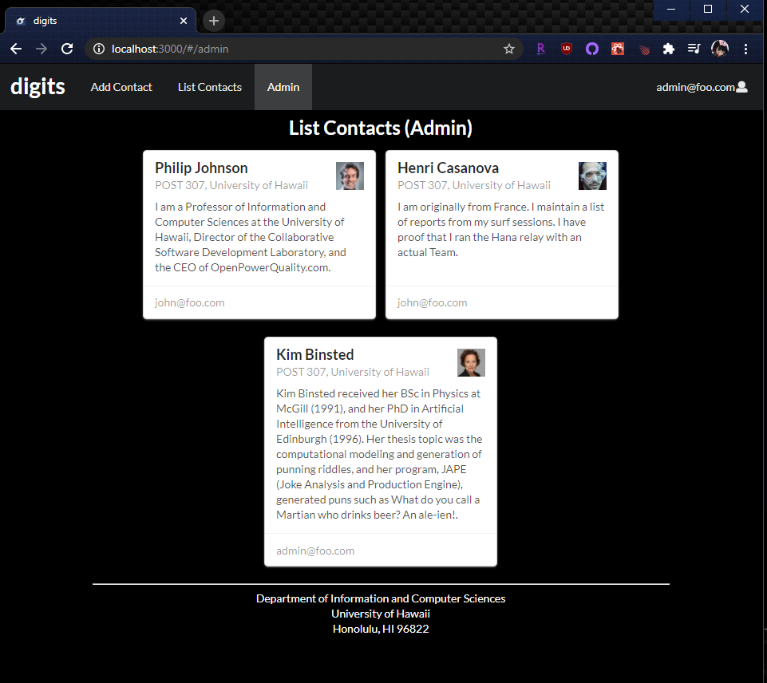

## Installation

First, [install Meteor](https://www.meteor.com/install).

Second, [download a copy of Digits](https://github.com/michelleluu/digits). Note that Digits is a private repo and so you will need to request permission from the author to gain access to the repo.

Third, cd into the app/ directory of your local copy of the repo, and install third party libraries with:

```
$ meteor npm install
```

## Running the system

Once the libraries are installed, you can run the application by invoking the "start" script in the [package.json file](https://github.com/ics-software-engineering/meteor-application-template-react/blob/master/app/package.json):

```
$ meteor npm run start
```

The first time you run the app, it will create some default users and data. Here is the output:

```
meteor npm run start

> meteor-application-template-react@ start /Users/philipjohnson/github/ics-software-engineering/meteor-application-template-react/app
> meteor --no-release-check --settings ../config/settings.development.json

[[[[[ ~/github/ics-software-engineering/meteor-application-template-react/app ]]]]]

=> Started proxy.
=> Started MongoDB.
I20180227-13:33:02.716(-10)? Creating the default user(s)
I20180227-13:33:02.742(-10)?   Creating user admin@foo.com.
I20180227-13:33:02.743(-10)?   Creating user john@foo.com.
I20180227-13:33:02.743(-10)? Creating default data.
I20180227-13:33:02.743(-10)?   Adding: Basket (john@foo.com)
I20180227-13:33:02.743(-10)?   Adding: Bicycle (john@foo.com)
I20180227-13:33:02.743(-10)?   Adding: Banana (admin@foo.com)
I20180227-13:33:02.744(-10)?   Adding: Boogie Board (admin@foo.com)
=> Started your app.

=> App running at: http://localhost:3000/
```


### Note regarding "bcrypt warning":

You will also get the following message when you run this application:

```
Note: you are using a pure-JavaScript implementation of bcrypt.
While this implementation will work correctly, it is known to be
approximately three times slower than the native implementation.
In order to use the native implementation instead, run

  meteor npm install --save bcrypt

in the root directory of your application.
```

On some operating systems (particularly Windows), installing bcrypt is much more difficult than implied by the above message. Bcrypt is only used in Meteor for password checking, so the performance implications are negligible until your site has very high traffic. You can safely ignore this warning without any problems during initial stages of development.

### Note regarding "MongoError: not master and slaveOk=false":

Intermittently, you may see the following error message in the console when the system starts up:

```
MongoError: not master and slaveOk=false
     at queryCallback (/Users/philipjohnson/.meteor/packages/npm-mongo/.3.1.1.1mmptof.qcqo++os+web.browser+web.browser.legacy+web.cordova/npm/node_modules/mongodb-core/lib/cursor.js:248:25)
     at /Users/philipjohnson/.meteor/packages/npm-mongo/.3.1.1.1mmptof.qcqo++os+web.browser+web.browser.legacy+web.cordova/npm/node_modules/mongodb-core/lib/connection/pool.js:532:18
     at _combinedTickCallback (internal/process/next_tick.js:131:7)
     at process._tickDomainCallback (internal/process/next_tick.js:218:9)
```

While irritating, this message appears to be harmless and [possibly related to a race condition between the development instance of Mongo and Meteor](https://github.com/meteor/meteor/issues/9026#issuecomment-330850366). By harmless, I mean that in most cases, the console goes on to display `App running at: http://localhost:3000/` and no problems occur during run time.

## User Interface Walkthrough
### Landing Page
When you first bring up the application, you will see the landing page that provides a brief introduction to the capabilities of Digits:


### Register
If you do not yet have an account on the system, you can register by clicking on “Login”, then “Sign Up”:


### Sign in 
Click on the Login link, then click on the Signin link to bring up the Sign In page which allows you to login:


### User home page 
After successfully logging in, the system takes you to your home page. It is just like the landing page, but the NavBar contains links to list contact and add new contacts:


### List Contacts
Clicking on the List Contacts link brings up a page that lists all of the contacts associated with the logged in user:

This page also allows the user to add timestamped “notes” detailing interactions they’ve had with the Contact. For example:


### Edit Contacts
From the List Contacts page, the user can click the “Edit” link associated with any Contact to bring up a page that allows that Contact information to be edited:


### Admin mode
It is possible to designate one or more users as “Admins” through the settings file. When a user has the Admin role, they get access to a special NavBar link that retrieves a page listing all Contacts associated with all users:



